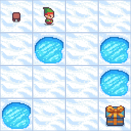
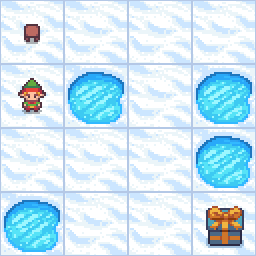
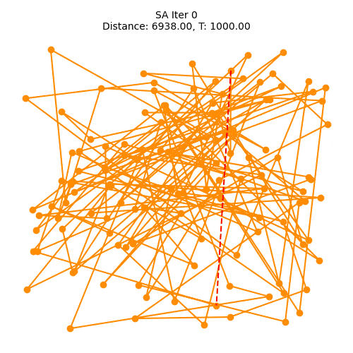

# 🧠 AI Assignment 2: Search Algorithms & Optimization Techniques

[](https://www.python.org/)
[](https://www.gymlibrary.dev/)


> **Course**: AI
> **Student**: Aman Anand (CS22B054)  
> **Institute**: IIT Tirupati  


---

## 📌 Overview

This repository provides a comprehensive comparison of fundamental search and optimization algorithms through two classical problem domains:

### 🌟 Key Features
- **Algorithm Showdown**: Direct performance comparison between:
  - **Exact Methods**: BnB vs IDA* (guaranteed optimal solutions)
  - **Metaheuristics**: HC vs SA (approximate optimization)
- **Diverse Environments**:
  - ❄️ **Frozen Lake**: Discrete state-space pathfinding
  - 🏙️ **TSP**: Continuous optimization for route planning
- **Practical Implementation**:
  - Custom algorithm implementations from scratch
  - Quantitative metrics collection framework
  - Animated solution visualizations

### 🎯 Problem Domains
| Environment        | Type          | Algorithms Used       | Key Metric          |
|--------------------|---------------|-----------------------|---------------------|
| Frozen Lake (4x4)  | Pathfinding   | BnB, IDA*             | Path Cost           |
| TSP (126 Cities)   | Optimization  | HC, SA                | Tour Distance       |

### 🧪 Experimental Design
- **Reproducible Benchmarking**: 5 trial runs per algorithm
- **Timeout Handling**: 10-minute cap for long executions
- **Visual Debugging**: GIF generation for solution paths
- **Heuristic Guidance**:
  - Manhattan distance for grid navigation
  - 2-opt swaps for TSP neighbor generation

**Reason for Why This Matters**:  
Understanding algorithm trade-offs is crucial for real-world applications like robotic navigation (Frozen Lake) and logistics planning (TSP). This project demonstrates how classical methods perform under different problem constraints.

---

## 🧪 Problem Setup

### Environments
- ❄️ **Frozen Lake (4x4 Grid)**  
  Used for **BnB** and **IDA***  
  *Non-slippery version from OpenAI Gym*
  
- 🔹 **TSP (126 Cities)**  
  Custom implementation using `gym_TSP`  
  *Random symmetric distance matrix with city coordinates*

### Heuristics
- **Frozen Lake**: Manhattan Distance (`h = |x₁−x₂| + |y₁−y₂|`)
- **TSP**: Total tour distance calculation

---

## 📊 Evaluation Metrics
- **Execution Time** (seconds)
- **Solution Quality** (path cost/distance)
- **Convergence Point** (iterations/steps)

All experiments ran 5 trials with 10-minute timeout (τ).

---

## 🔎 Key Results

### ❄️ Frozen Lake Performance
  
*Branch and Bound solution path*

  
*IDA* solution using Manhattan heuristic*

| Algorithm | Avg Time (s) | Path Cost |
|-----------|--------------|-----------|
| BnB       | 0.00012      | 6         |
| IDA*      | 0.00009      | 6         |

**Insights**:
- Both algorithms find optimal path (cost=6)
- IDA* 24% faster due to heuristic guidance

---

### 🏙️ TSP Performance
  
*Hill Climbing route evolution*

  
*SA with temperature decay*

| Algorithm | Avg Time (s) | Best Distance |
|-----------|--------------|---------------|
| HC        | 172.3        | 3055-3166     |
| SA        | 12.8         | 3454-3631     |

**Insights**:
- HC achieves 12-18% shorter routes but 13x slower
- SA faster but suboptimal due to aggressive cooling (start_temp=1000, decay=0.995)

---

## ⚙️ Installation & Usage

1. **Clone Repository**:
```bash
git clone git@github.com:AMAN9876543210/AI_Assignment_2_cs22b054.git
pip install gymnasium numpy matplotlib imageio opencv-python

cd AI_Assignment_2_cs22b054
```
## 🚀 Running the Experiments

### 🧊 Frozen Lake

```bash
cd FrozenLakeSolver

# Run BnB algorithm
python3 bnb_frozen_lake.py         # Generates: bnb_frozen_lake.gif

# Run IDA* algorithm
python3 ida_frozen_lake.py         # Generates: ida_frozen_lake.gif

# Run timing benchmark (5 trials)
python3 run_timing_experiment.py   # Outputs: execution_log.txt and execution_times.csv
```
### 🗺️ Traveling Salesman Problem (TSP)

```bash
cd TSPSolvers/gym_TSP

# Run benchmark for HC and SA
python3 run_timing_experiments.py  # Outputs: results_summary.csv and route GIFs
# hill_climbing.py and simulated_annealing.py will run and stores execution details in execution_details.log
```
## 📂 Repository Structure

```
.
├── FrozenLakeSolver/
│   ├── bnb_frozen_lake.py        # BnB implementation
│   ├── ida_frozen_lake.py        # IDA* with Manhattan heuristic
│   ├── run_timing_experiment.py  # Performance comparison
│   ├── execution_times.csv       # Timing results
│   ├── execution_log.txt         # Detailed logs
│   └── *.gif                     # Path visualizations
│
└── TSPSolvers/
    └── gym_TSP/
        ├── hill_climbing.py       # HC implementation
        ├── simulated_annealing.py # SA with cooling schedule
        ├── run_timing_experiments.py # Automated benchmark
        ├── results_summary.csv    # Comparative results
        ├── execution_details.log  # Algorithm outputs
        └── *.gif                  # Route evolution animations
```
---
## 📽️ Presentation

- [Slides Link](https://www.notion.so/AI_Assignment_2-1cc18fc7a5aa806fa344e02a721d6f65?pvs=4)
  

## 🔗 GitHub Repository

[👉 AI_ Repo_Link ](https://github.com/AMAN9876543210/AI_Assignment_2_cs22b054/)

---

## 🙏 Acknowledgements

- Great respect for AI course instructor and TA.
---
